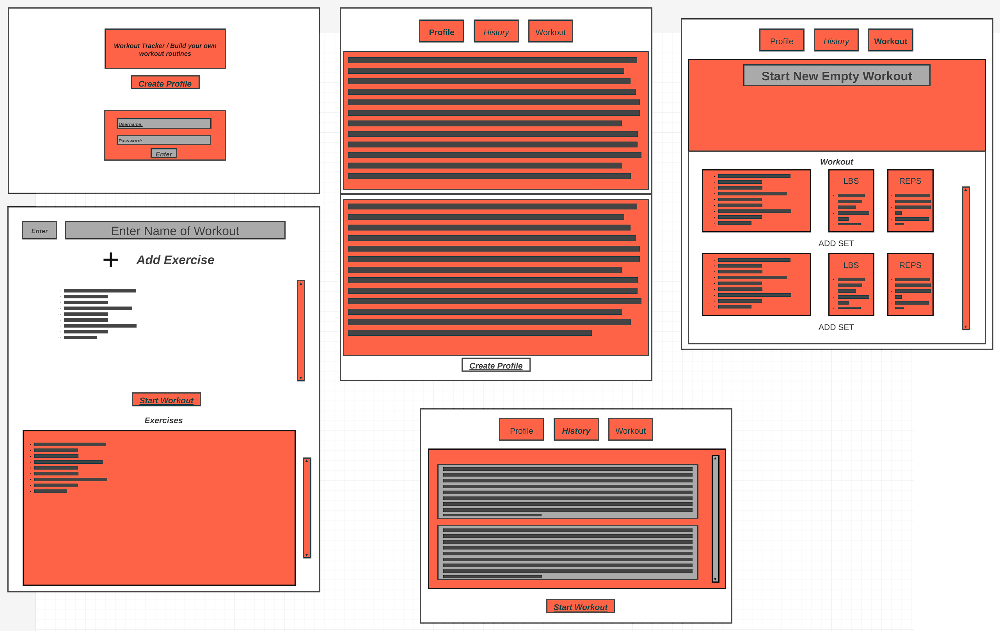

# workout_app

This app is a mirror of my favorite workout app called "strong". The app allows the user to have a wide range of control over the workouts they do.

The USER will start by either logining in to there profile so they can save there workouts and find them for later workouts. This page will also have a button to send the USER to a create / "update" profile (MAYBE UPDATE)
    - The create page will also be the profile page that the USER and input whatever they want to.
    - Will require a email/username and password.

You can create a workout by using a blank template that allows you to choose different workouts you want to do. These workout can be added and delete. Once you have build a template for your workout it will save that template and transfer you to another page to choose how many sets you want to do and you can also enter the number of reps and weight you used. 

I would like to find a API or two to take all of the workouts so I dont have to rebuild a database of wortkout. I would also like to make a template for the different exrcises one can do.

# Wireframe

# Trello Workout_app

[Project-Board](https://trello.com/b/q0jl09YV/my-trello-board)

# App Breakdown

I will have have 5 pages
- Login page / Create Button
- Create page / View Profile
- Workout CRUD page / Create Template
- Exercise CRUD / Exercise view
- History of Workouts

# POST MVP

Create a professional view.
Template for exercise you do.

# Credits